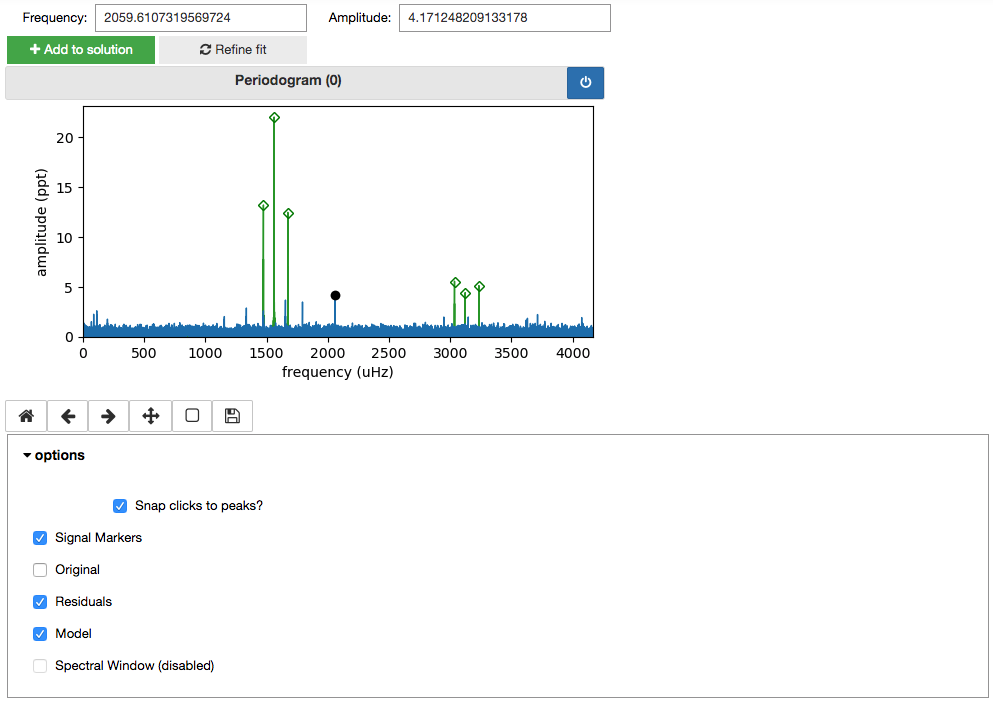
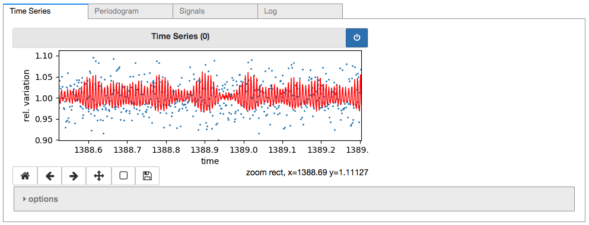

Pyriod is primarily meant to be run interactively in a Jupyter notebook (convenient functions for scripting analyses without the GUI are being developed).  To display the interactive widgets, you must type the `%matplotlib widget` magic command at the top of your Jupyter notebook.  Then import Pyriod.
````
%matplotlib widget
from Pyriod import Pyriod
````
Time series data can be provided as a lightkurve.LightCurve object (preferred) or from time and flux arrays when the Pyriod class is instantiated.
````
import lightkurve as lk
lc = lk.search_lightcurvefile('TIC 257459955',mission='TESS',sector=3).download().get_lightcurve("PDCSAP_FLUX").flatten(2161).remove_outliers(5)

pyriod = Pyriod(lc)
````
For now, the times are expected to be given in days and frequencies will be displayed in microHz, though providing other unit options is as planned improvement.  The units for providing signal amplitudes can be chosen from `['relative', 'percent', 'ppt', 'ppm', 'mma']`.

# Time Series tab

To display and interact with the time series data, call
````
pyriod.TimeSeries()
````
You can zoom around on or save the figure from the toolbar. As you fit frequency solutions, the red line will display the current model. From the accordion dropdown you can access options, including choosing whether to display the original or residuals time series, as well as folding the time series on some frequency.


# Periodogram tab

Access the periodogram tab by calling
````
pyriod.Periodogram()
````

This displays the periodogram of the original data.  You can click on peaks to stage them for adoption into your frequency solution. Click "Add to solution" to add the currently selected peak to the model.  Then click "Refine fit" to fit the model with the new signals to the time series.  The plot will update to show the periodogram of the residuals, and the periodogram of the model will be displayed in the background.

You can expand the options to choose which periodograms to display in the plot and whether your clicks should snap to the highest nearby peak.



# Signals tab

You can display a table of signals in your frequency solution by calling
````
pyriod.Signals()
````
The table provides current best-fit values and uncertainties from the last time "Refine fit" was called, with approximate values included for recently added signals.  The [Qgrid](https://github.com/quantopian/qgrid) table can be sorted and columns rearranged as needed.  You can also edit values as you wish, de-select those signals that you wish to "include" in the solution, or select the values for signal frequencies, amplitudes, or phases that you want to keep fixed during the fitting.

** *Gotcha:* ** Unfortunately, Qgrid tables don't register a change if you click away from the table without first hitting Enter or clicking elsewhere within the table. This can make for a frustrating and unintuitive experience, and I hope that Qgrid will address [this issue](https://github.com/quantopian/qgrid/issues/251).

The buttons for adding signals to the solution and refining the fit are repeated here for convenience. There is also a button for deleting all selected rows.

You can also add combination frequencies by typing arithmetic expressions in the "Frequency" field. These should involve the independently labeled signals (`f0, f1, f2...`) such as `2*f0` or `f1+f2`. These arithmetic relationships between frequencies will be enforced in the fitting procedure.

You can save the frequency solution to the provided csv filename (relative path), or load one from a previous analysis.


# Log
The Log records important actions taken as part of your analysis for reproducibility and can be saved to plain text.

````
pyriod.Log()
````


# Pyriod suite

Finally, if you want to do your entire analysis in a single cell with a single call, use
````
pyriod.Pyriod()
````
and navigate between the different tabs.


